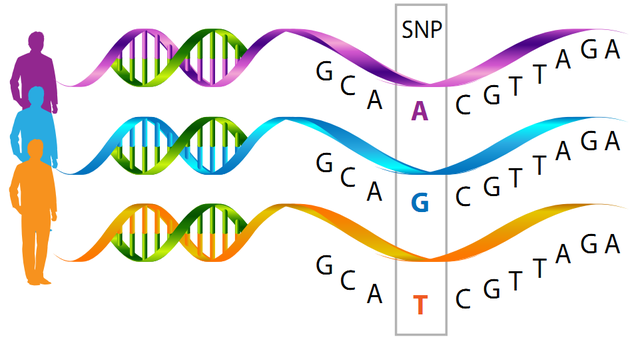

Sequence Alignment
==================

## Individual differences in genome sequence

In genetics a single-nucleotide polymorphism (SNP: pronounced “snip”) is a substitution of a single nucleotide at a specific position in the genome. It is the most common type of genetic variation among organisms. It is known to occur once in every 1000 nucleotides. Most SNPs have no effect on health but they have proven to be very critical key to help predict an individual’s feature such as certain drugs responses or reactions. SNPs can also be important to track the inheritance of disease genes, and to study the association between complex diseases such as heart disease, diabetes, and cancer.

\[Figure from [gendai.ismedia.jp](https://gendai.ismedia.jp/articles/-/56804)\]

## References

* What are single nucleotide polymorphisms (SNPs)?. MedlinePlus. U.S. National Library of Medicine [[SNP]](https://medlineplus.gov/genetics/understanding/genomicresearch/snp/)(Retrieved on 2021/01/31)

* 