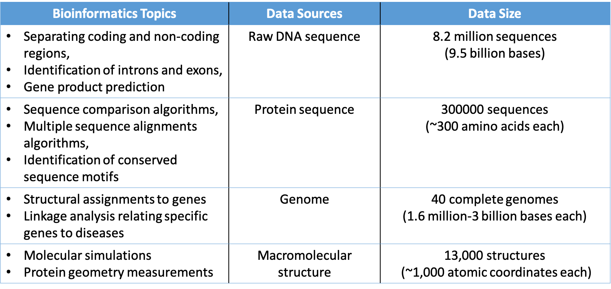

Introduction
=======================

## Bioinformatics

Bioinformatics is the science of collecting and analyzing complex biological data. 
It is not just an experimental data processing using a computer, but a process of applying informatics techniques:
mathematical model, computer science and statistics, to present and analyze biological data. 

## Aims of bioinformatics

There are three main aims of bioinformatics. Firstly, bioinformatics aims to organize data in a way that allows researchers to simply access and process existing information on a computer. An example of this kind of work is large biological database systems such as Protein Data Bank for 3D macromolecular structures. While data collecting and organizing is an essential task, the information stored in databases is useless until it is analyzed. Therefore the purpose of this field is far beyond mere volume control. Secondly, bioinformatics aims to develop tools that aid in data analysis. In this case, the development of mathematical modeling and efficient algorithms are critical research tasks. Thirdly, it aims to use these informatics tools to analyze biological data and interpret the results in a meaningful biological aspect.

## Bioinformatics topics and Data sources

## Organism as a hierarchical information system

Living things on earth can be understood as hierarchical information systems. This concept is known as system biology.
The idea is that, in order to fully understand the complexity of life at all these different levels, we need to analyze the organization, interactions, and control of the many smaller components of a biological system in an integrated way. However, even consider a cell which is a basic component as a system, we still have difficulties since the internal structure is extremely complex and abundant in the number of types of partial components(about 25000 genes and 100000 proteins in the case of the human). As a result, it is hard to directly analyze the systems with physicochemical approaches. And it is a critical key to taking informatics techniques into account.

## DNA, gene, genome

In bioinformatics, as shown in the previous section, the research topics are mainly focused on molecule aspects which is known as molecular biology. Keywords which are confusing in this area are DNA sequence, gene and genome. 

* **DNA** is a string of complex organic molecules called [nucleotides](https://en.wikipedia.org/wiki/Nucleotide). DNA contains the genetic information of life. It is a set of instructions to build and maintain life. DNA is unique(except identical twin) and mostly located in every human cell called nucleus (some found in mitochondria).

* If we consider DNA as a molecular instruction book, **gene**  a short section or little paragraph of DNA. Gene are instructions that cells use to make proteins.

* A **genome** is an organism's complete set of DNA. If the DNA is a set of instructions that is organized into paragraph(which is gene) then the entire manual from the begining to the end would be the genome.

## DNA

DNA = Deoxyribonucleic acid. It is a molecule composed of two polynucleotide chains that coil around each other. The information in DNA is stored as a code made up of four chemical bases: adenine (A), guanine (G), cytosine (C), and thymine (T). The order, or sequence, of these bases determines the information available for building and maintaining an organism. This feature is similar to the way in which letters of the alphabet appear in a certain order to form words. DNA bases pair up with each other to form units called base pairs (A with T and C with G). An crucial property of DNA is that it can make copies of itself(replication). 

<!--

-->

\[Figures from [Wiki](https://en.wikipedia.org/wiki/DNA)\]

## References

* Luscombe, Nicholas & Greenbaum, Dov & Gerstein, Mark. (2000). What is bioinformatics? An introduction and overview. Yearbook of Medical Informatics. 10. 10.1055/s-0038-1638103.

* Bas E. Dutilh & Can Keșmir (2016). Theoretical Biology and Bioinformatics.  Utrecht University.

* Arthur M. Lesk (2014).INTRODUCTION TO BIOINFORMATICS FOURTH EDITION. Oxford University Press

* Gabriella Beer (2018). Science surgery: “What’s the difference between the words genome, gene and chromosome?”. CANCER RESEARCH UK. [[URL]](https://scienceblog.cancerresearchuk.org/2018/05/29/science-surgery-whats-the-difference-between-the-words-genome-gene-and-chromosome/)

* What is DNA?. MedlinePlus. U.S. National Library of Medicine [[DNA]](https://medlineplus.gov/genetics/understanding/basics/dna/) (Retrieved on 2021/01/31)

* DNA [https://en.wikipedia.org/wiki/DNA](https://en.wikipedia.org/wiki/DNA)